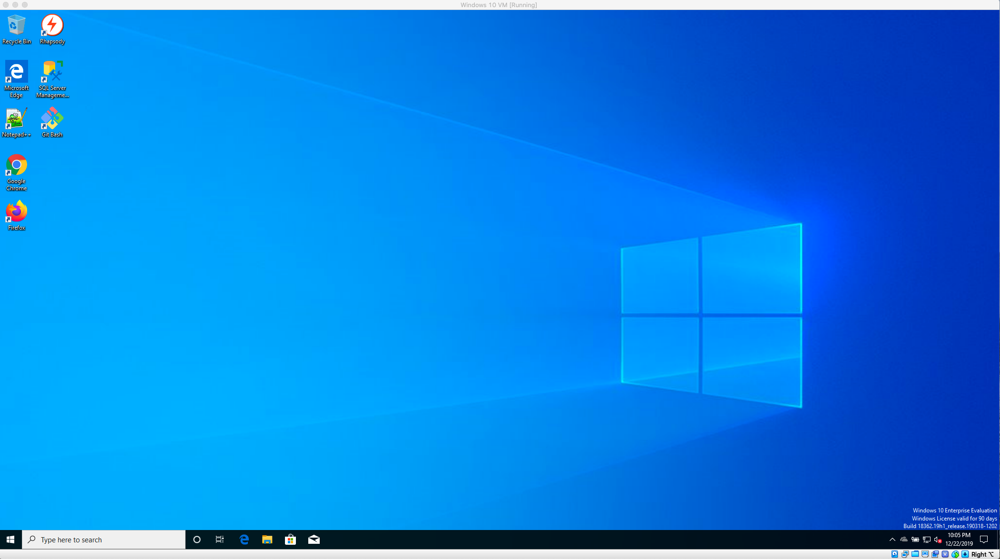
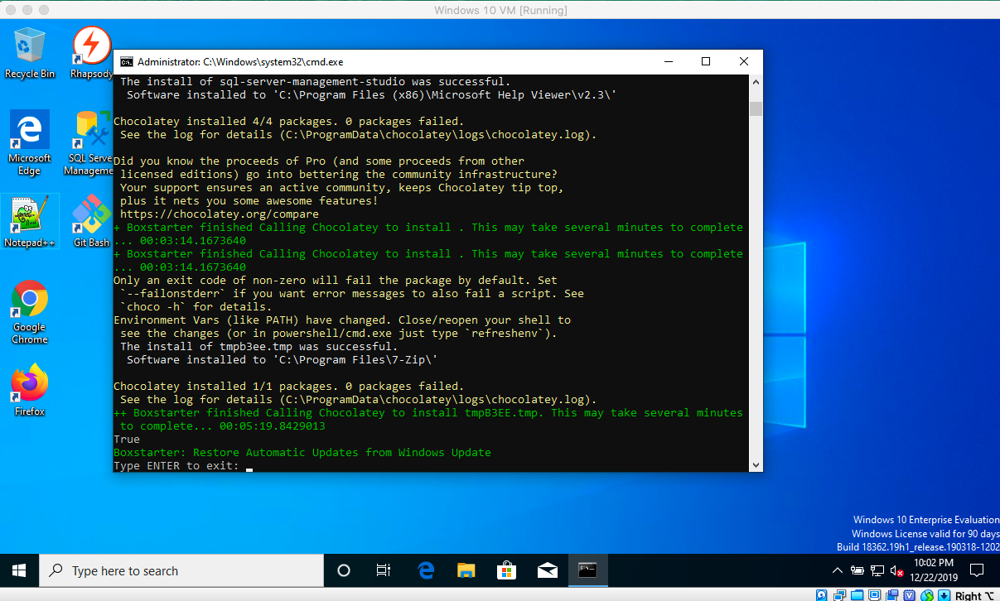

# Windows 10 Vagrant Box with pre installed applications



Will set up a virtual machine with useful applications
 * Notepad++
 * SQL Server Management Studio
 * Git Bash
 * Chrome
 * Firefox
 * 7zip

Other features
 * Shared clipboard between VM and host machine
 * The repository directory on the host machine is shared with the C:\vagrant directory in the VM
 * Port forwarding pre-configured


### Prerequisites

Requires vagrant 2.2.7+
https://www.vagrantup.com/

Requires virtualbox 6.0.x 
https://www.virtualbox.org/wiki/Download_Old_Builds_6_0

### Installing

Clone this repository

```
git clone <repository>
```

Run vagrant up. This will start setting up the virtual machine. Please allow 3 hours for setup to complete (The first time running will take the longest as the Windows 10 image needs to be downladed, subsequent runs will be approx. 45 minutes). Once the vagrant command completes, the virtual machine will restart and continue setting up the applications with Powershell.

```
vagrant up
```

When prompted to do so within the VM, type in 'enter' and press the return key to complete the setup



```
enter
```


### Uninstalling

Run vagrant destroy from host machine

```
vagrant destroy
```

